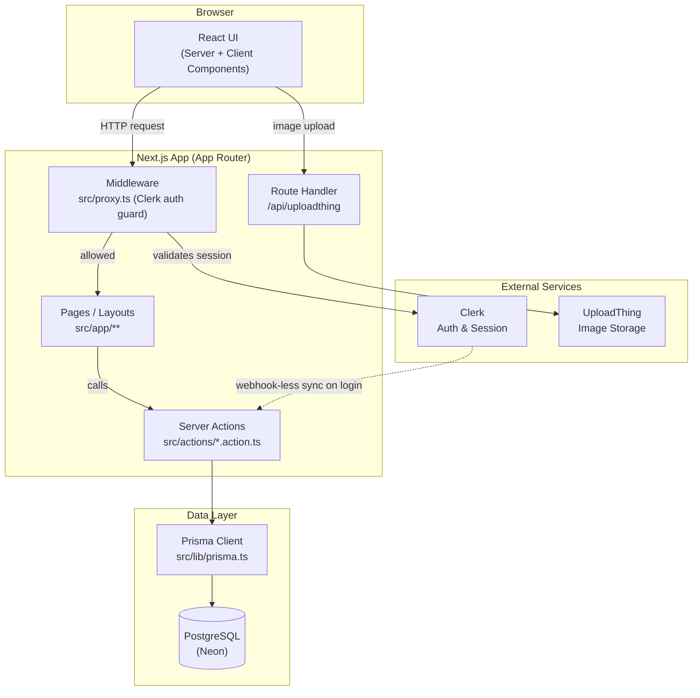
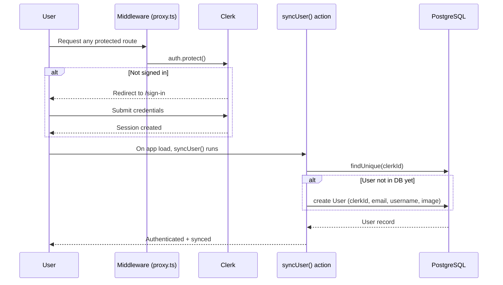
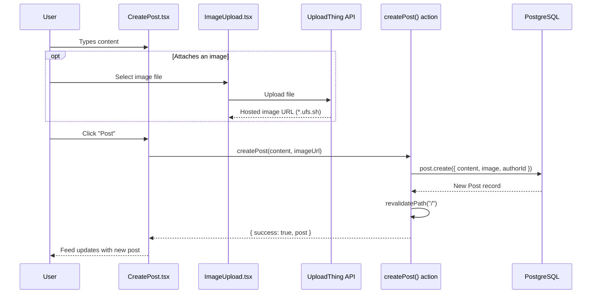
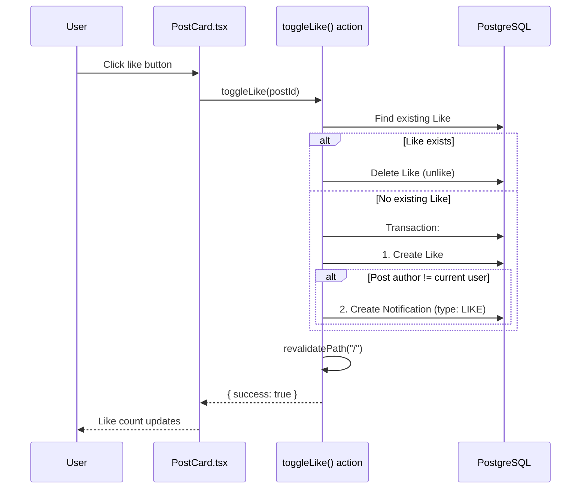
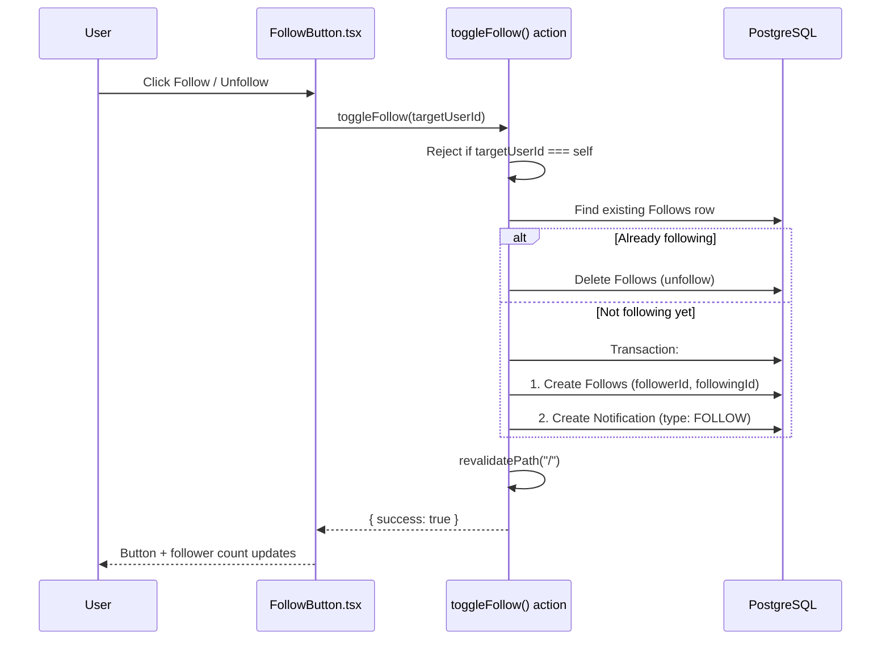
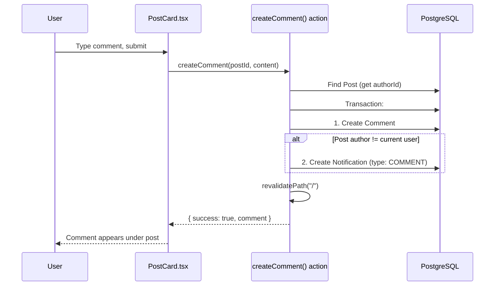
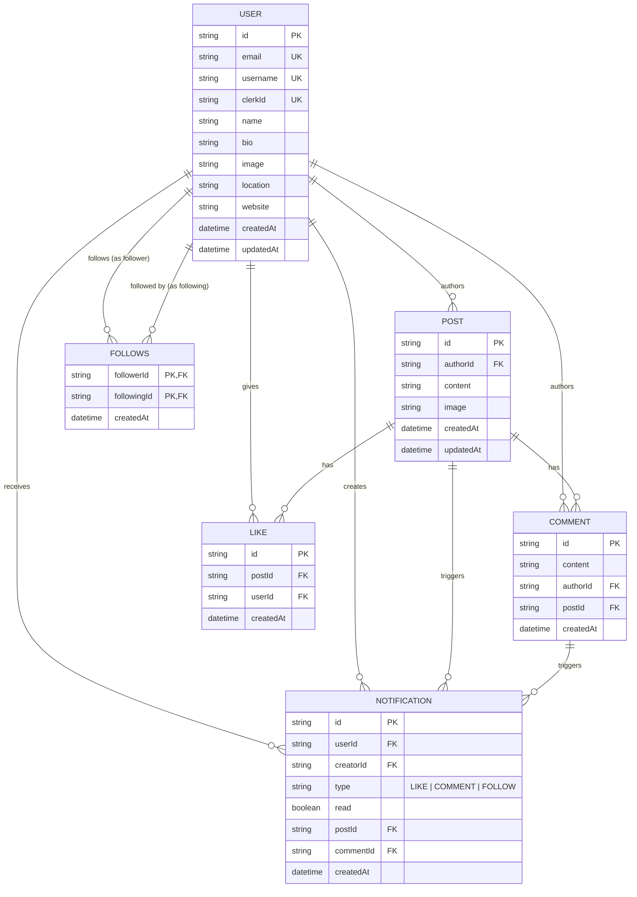

<a name="top"></a>

<div align="center">


<br/>

[](https://git.io/typing-svg)

<p align="center">
  A full-stack social media web app built with Next.js. Users can sign up, create posts with images, follow other people, like and comment on posts, and get notified when someone interacts with their content — all backed by a real relational database.
</p>

<br/>

<!-- Tech badges -->
<p align="center">
  
  
  
  
  
  <br/>
  
  
  
  
  
</p>

<!-- Repo badges -->
<p align="center">
  
  
  
  
</p>

<p align="center">
  
</p>

<p align="center">✦ ✧ ✦ ✧ ✦ ✧ ✦ ✧ ✦ ✧ ✦ ✧ ✦</p>

<p align="center">
  Live previw https://klyro-social-media-app.vercel.app/
</p>

</div>

---

## 📚 Table of Contents

- [📖 Overview](#overview)
- [🚀 Features](#features)
- [🛠 Tech Stack](#tech-stack)
- [🏗 System Architecture](#system-architecture)
- [🔄 Flow Diagrams](#flow-diagrams)
  - [1. Authentication Flow](#1-authentication-flow)
  - [2. Create Post Flow](#2-create-post-flow)
  - [3. Like + Notification Flow](#3-like--notification-flow)
  - [4. Follow + Notification Flow](#4-follow--notification-flow)
  - [5. Comment Flow](#5-comment-flow)
- [🗄 Database Schema (ER Diagram)](#database-schema-er-diagram)
- [📂 Project Folder Structure](#project-folder-structure)
- [⚙ Environment Variables](#environment-variables)
- [⚡ Getting Started](#getting-started)
- [📸 Screenshots](#screenshots)
- [🧪 What's Missing / Roadmap](#whats-missing--roadmap)
- [📄 License](#license)

<p align="center">✦ ✧ ✦ ✧ ✦ ✧ ✦ ✧ ✦ ✧ ✦ ✧ ✦</p>

<a name="overview"></a>

## 📖 Overview

Klyro is a Twitter/X-style social platform built to practice full-stack product engineering end to end — not just CRUD, but authentication, file uploads, relational data modeling, and UI state that reacts to real user interaction.

Core loop: a user signs in, posts text and/or an image, other users like/comment/follow, and the post author gets notified. Everything is server-rendered where possible using Next.js Server Components and Server Actions, with Prisma talking to a PostgreSQL database.

> [!TIP]
> The whole app runs on Server Actions instead of a separate REST/GraphQL layer — pages call functions in `src/actions/*.action.ts` directly. Less boilerplate, fully typed end to end.

---

<a name="features"></a>

## 🚀 Features

| ✨ | Feature | Details |
|---|---|---|
| 🔐 | **Authentication** | Sign up / sign in handled by Clerk, with automatic syncing of Clerk users into the app's own database (`syncUser`). |
| 📝 | **Post creation** | Create posts with text content and/or an uploaded image. |
| 🏠 | **Home feed** | All posts shown in latest-first order with author info, like count, and comment count. |
| ❤️ | **Likes** | Like/unlike a post; unliking removes the like, liking creates a notification for the post author (unless you're liking your own post). |
| 💬 | **Comments** | Comment on any post; commenting on someone else's post creates a notification. |
| 🤝 | **Follow system** | Follow/unfollow other users; a "Who to Follow" widget suggests users you don't already follow. |
| 🔔 | **Notifications** | A dedicated page listing LIKE, COMMENT, and FOLLOW notifications with read/unread state. |
| 🪪 | **Profile pages** | Per-username profile with bio, location, website, join date, and follower/following/post counts. |
| 🛡 | **Authorization checks** | Only the original author can delete their own post. |
| 🖼 | **Image uploads** | Post images uploaded via UploadThing, stored off-server and served over HTTPS. |
| 🌗 | **Dark / light theme** | Full theme toggle using `next-themes`. |
| 📱 | **Responsive layout** | Separate desktop and mobile navbars. |

---

<a name="tech-stack"></a>

## 🛠 Tech Stack

<div align="center">


</div>

<br/>

<details open>
<summary><strong>📋 Full breakdown — what each piece is doing and why</strong></summary>

<br/>

| Technology | Purpose |
|---|---|
| **Next.js 16 (App Router, Turbopack)** | Core framework — server components, server actions, file-based routing, no separate backend needed. |
| **React 19** | Component-driven UI. |
| **TypeScript** | Static typing across the whole codebase to catch errors at compile time. |
| **Prisma ORM (`@prisma/client`, `@prisma/adapter-pg`)** | Type-safe database access layer, maps Postgres tables to typed models and simplifies relational queries (likes, comments, follows). |
| **PostgreSQL** | Relational database — the data model (users, posts, likes, comments, follows) is inherently relational. |
| **Clerk (`@clerk/nextjs`)** | Authentication and session management, so sign-up/sign-in/session handling didn't need to be built from scratch. |
| **UploadThing** | Handles image upload, storage, and URL generation for post images. |
| **Tailwind CSS 4** | Utility-first styling for the entire UI. |
| **Radix UI + shadcn** | Accessible, unstyled UI primitives (dialog, tabs, avatar, sheet, etc.) used as the base for the design system. |
| **lucide-react** | Icon set used throughout the UI. |
| **next-themes** | Dark/light mode toggle with system preference support. |
| **date-fns** | Human-readable timestamp formatting on posts/comments/notifications. |
| **react-hot-toast** | Lightweight toast notifications for success/error feedback. |
| **class-variance-authority / clsx / tailwind-merge** | Utility helpers for composing conditional Tailwind class names. |

</details>

---

<a name="system-architecture"></a>

## 🏗 System Architecture

> [!NOTE]
> The diagram below is rendered live from Mermaid — logic and structure are unchanged from the source of truth.



### 🧭 How it fits together

1. Every request first passes through `src/proxy.ts`, a Clerk middleware that allows public routes (`/`, `/sign-in`, `/sign-up`, `/api/uploadthing`) and requires auth on everything else.
2. Pages are React Server Components that call **Server Actions** (`"use server"` functions in `src/actions/`) directly — no separate REST/GraphQL API layer for app data.
3. Server Actions use the **Prisma Client** (`src/lib/prisma.ts`) to talk to **PostgreSQL**.
4. Image uploads go through the **UploadThing** route handler (`src/app/api/uploadthing`), which returns a hosted file URL that gets saved on the `Post` record.
5. `next.config.ts` whitelists `*.ufs.sh` (UploadThing's CDN domain) for Next's `<Image>` optimization.

---

<a name="flow-diagrams"></a>

## 🔄 Flow Diagrams

<a name="1-authentication-flow"></a>

### 1️⃣ Authentication Flow



<a name="2-create-post-flow"></a>

### 2️⃣ Create Post Flow



<a name="3-like--notification-flow"></a>

### 3️⃣ Like + Notification Flow



<a name="4-follow--notification-flow"></a>

### 4️⃣ Follow + Notification Flow



<a name="5-comment-flow"></a>

### 5️⃣ Comment Flow



---

<a name="database-schema-er-diagram"></a>

## 🗄 Database Schema (ER Diagram)



> [!IMPORTANT]
> `Follows` uses a composite primary key (`followerId`, `followingId`) to prevent duplicate follow rows, and all foreign keys cascade on delete so removing a user cleans up their posts, likes, comments, follows, and notifications automatically.

---

<a name="project-folder-structure"></a>

## 📂 Project Folder Structure

<details open>
<summary><strong>Click to expand the full tree</strong></summary>

```
social-medial/
├── prisma/
│   └── schema.prisma              # Data model: User, Post, Comment, Like, Follows, Notification
├── prisma.config.ts                # Prisma config (schema path, migrations, datasource URL)
├── public/
│   └── avatar.png                  # Default avatar fallback
├── src/
│   ├── proxy.ts                     # Clerk middleware — route protection (acts as Next.js middleware)
│   ├── actions/                     # Server Actions ("use server") — the app's data/API layer
│   │   ├── user.action.ts           # syncUser, getDbUserId, getRandomUsers, toggleFollow
│   │   ├── post.action.ts           # createPost, getPosts, toggleLike, createComment, deletePost
│   │   ├── profile.action.ts        # getProfileByUsername, getUserPosts, profile updates
│   │   └── notification.action.ts   # getNotifications, markNotificationsAsRead
│   ├── app/                         # App Router pages & layouts
│   │   ├── layout.tsx                # Root layout: ClerkProvider, ThemeProvider, Navbar, Sidebar
│   │   ├── globals.css               # Tailwind base + design tokens
│   │   ├── not-found.tsx             # Custom 404
│   │   ├── (main)/
│   │   │   ├── page.tsx              # Home feed
│   │   │   └── about/page.tsx        # About page (placeholder)
│   │   ├── notifications/page.tsx    # Notifications page
│   │   ├── profile/[username]/
│   │   │   ├── page.tsx              # Profile page (server)
│   │   │   └── ProfilePageClient.tsx # Profile page (client interactions)
│   │   ├── sign-in/[[...sign-in]]/page.tsx
│   │   ├── sign-up/[[...sign-up]]/page.tsx
│   │   ├── api/uploadthing/
│   │   │   ├── core.ts               # UploadThing file router (postImage: 4MB, 1 file)
│   │   │   └── route.ts              # UploadThing route handler (GET/POST)
│   │   └── fonts/                    # Local Geist font files
│   ├── components/
│   │   ├── Navbar.tsx / DesktopNavbar.tsx / MobileNavbar.tsx / NavPill.tsx
│   │   ├── Sidebar.tsx                # Left sidebar (profile summary + nav)
│   │   ├── CreatePost.tsx             # Post composer
│   │   ├── PostCard.tsx               # Single post: like/comment/delete UI
│   │   ├── ImageUpload.tsx            # UploadThing image picker
│   │   ├── FollowButton.tsx           # Follow/unfollow toggle
│   │   ├── WhoToFollow.tsx            # Follow suggestions widget
│   │   ├── TrendingCard.tsx           # Trending/discovery widget
│   │   ├── ExpressYourselfCard.tsx    # Prompt-to-post widget
│   │   ├── NotificationSkeleton.tsx   # Loading state for notifications
│   │   ├── DeleteAlertDialog.tsx      # Confirm-before-delete modal
│   │   ├── theme-provider.tsx / toggle-mode.tsx  # Dark/light theme
│   │   ├── decorative/
│   │   │   ├── BackgroundDecor.tsx
│   │   │   └── Doodles.tsx
│   │   └── ui/                        # shadcn/Radix primitives (button, card, dialog,
│   │                                  # tabs, avatar, sheet, textarea, skeleton, etc.)
│   ├── generated/prisma/              # Prisma-generated typed client (auto-generated, do not edit)
│   └── lib/
│       ├── prisma.ts                  # Prisma client singleton
│       ├── uploadthing.ts             # UploadThing React helpers
│       └── utils.ts                   # cn() class-merging helper
├── components.json                    # shadcn config (style, aliases, icon library)
├── next.config.ts                     # Allows *.ufs.sh (UploadThing) as an image source
├── eslint.config.mjs
├── tsconfig.json
└── package.json
```

</details>

---

<a name="environment-variables"></a>

## ⚙ Environment Variables

Create a `.env.local` file in the project root with:

| Variable | Description |
|---|---|
| 🔑 `NEXT_PUBLIC_CLERK_PUBLISHABLE_KEY` | Clerk public key (client-side auth widgets). |
| 🔒 `CLERK_SECRET_KEY` | Clerk secret key (server-side auth). |
| 🗄 `DATABASE_URL` | PostgreSQL connection string (this project uses Neon). Keep this secret — server-only. |
| 🖼 `UPLOADTHING_TOKEN` | UploadThing API token for image upload handling. |

> [!WARNING]
> Never commit `.env.local` or expose `DATABASE_URL` / `CLERK_SECRET_KEY` client-side. These are server-only secrets.

---

<a name="getting-started"></a>

## ⚡ Getting Started

Follow these steps to get Klyro running locally:

**1. Install dependencies**

```bash
npm install
```

**2. Set up environment variables** (see [⚙ Environment Variables](#environment-variables) above)

```bash
cp .env.example .env.local   # then fill in real values
```

**3. Push the Prisma schema to your database**

```bash
npx prisma db push
```

**4. Generate the Prisma client** (also runs automatically via `postinstall`)

```bash
npx prisma generate
```

**5. Run the dev server**

```bash
npm run dev
```

> [!NOTE]
> Open **[http://localhost:3000](http://localhost:3000)** in your browser once the dev server is running. 🎉

---

<a name="screenshots"></a>

## 📸 Screenshots

> [!TIP]
> Add screenshots to a `docs/screenshots/` folder and reference them below.

<div align="center">

| 🏠 Home Feed | 🪪 Profile Page |
|:---:|:---:|


 
| *The main feed — posts, likes, and comments in real time.* | *A user's profile with bio, stats, and their posts.* |

| 🔔 Notifications | 🌙 Dark Mode |
|:---:|:---:|


| *Likes, comments, and follows in one place.* | *Full dark theme, powered by `next-themes`.* |

</div>

<a name="whats-missing--roadmap"></a>

## 🧪 What's Missing / Roadmap

#### ✅ Completed

- [x] Authentication with Clerk + automatic user sync
- [x] Post creation with text + image upload
- [x] Home feed with likes and comment counts
- [x] Like / unlike with notifications
- [x] Comment system with notifications
- [x] Follow / unfollow system with suggestions
- [x] Notifications page (LIKE, COMMENT, FOLLOW)
- [x] Profile pages with stats
- [x] Author-only post deletion
- [x] Dark / light theme toggle
- [x] Responsive desktop / mobile navigation

#### ⏳ Planned

- [ ] No real-time updates — feed and notifications rely on `revalidatePath`, not websockets or polling.
- [ ] No search for users or posts.
- [ ] No direct messaging between users.
- [ ] No pagination / infinite scroll — the feed currently loads everything at once.
- [ ] No image cropping/compression before upload.
- [ ] `about` page is still a placeholder.
- [ ] No rate limiting on posting/liking/commenting server actions.
- [ ] No automated tests around server actions.

> [!NOTE]
> Planned improvements: pagination/infinite scroll, real-time notifications, search, direct messaging, image optimization before upload, rate limiting, and test coverage for the `src/actions/*` layer.

---

<a name="license"></a>

## 📄 License

This project is for personal/educational use. Add a license of your choice if you plan to open-source it.

<details>
<summary>📊 GitHub Stats https: //github.com/Abhay-Pratap200001/Klyro-Social--media-app/commits/main/  </summary>

<br/>

<div align="center">
  
</div>

</details>

---

<div align="center">

<p align="center">✦ ✧ ✦ ✧ ✦ ✧ ✦ ✧ ✦ ✧ ✦ ✧ ✦</p>

### 🤝 Contributing

Issues and pull requests are welcome — feel free to open one if you spot a bug or want to suggest an improvement.

<br/>

Built with ❤️ and ☕ by **Abhay Pratap** 👋

[](https://github.com/Abhay-Pratap200001)

<br/>

**[⬆ Back to Top](#top)**


</div>
